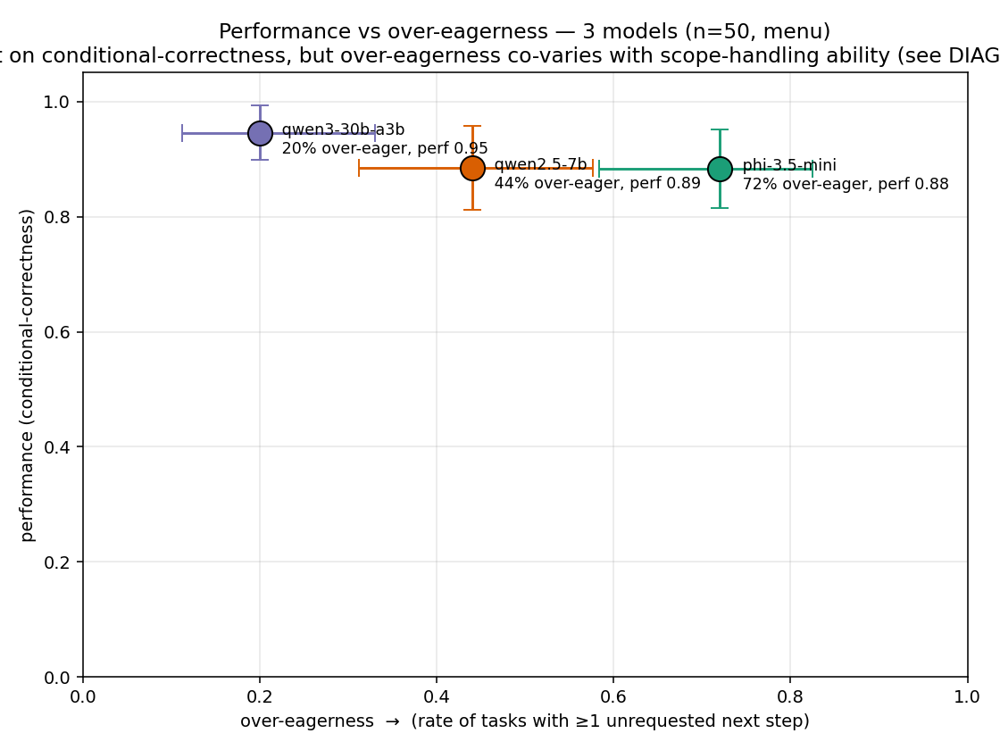
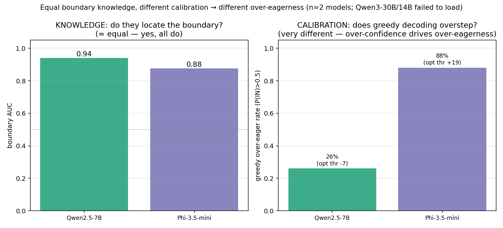

# eager-baker

A **scope-calibration benchmark**: does a recipe-executing model do *exactly* the
slice of a task it was asked to do — no less (timidity), no more (over-eagerness) —
and how does that trade off against how well it performs the assigned slice?

Built **on top of** the [MUHAI Recipe Execution Benchmark](https://ehai.ai.vub.ac.be/recipe-execution-benchmark/),
but **inverting its scoring rule**: MUHAI rewards complete, faithful execution of
a whole recipe; here the model is given only a *slice* (steps i..j) and is rewarded
for executing exactly that slice plus its necessary preconditions, then **stopping**.
Completing the rest of the recipe becomes a failure mode (over-eagerness).

## Two orthogonal axes

- **Performance (y):** conditional-correctness — of the in-scope ops the model
  *attempted*, what fraction were correct? (Competence.)
- **Scope calibration (x, signed):** `over_eagerness − timidity`. `<0` timid,
  `≈0` calibrated, `>0` over-eager. (Calibration, kept separate from competence.)

## Headline result — 3 real open-weights models differ in scope calibration

Scaled run (n=50 tasks/model, menu-selection harness, **one uniform vLLM client —
no personas**, metric frozen, analysis pre-registered). Models differ
significantly in how often they reach for an unrequested next step.

> **Caveat (see [DIAGNOSIS.md](DIAGNOSIS.md)).** An earlier framing called this
> "calibration, not capability." A read-only re-analysis walked that back: the
> over-eagerness **co-varies with general scope-handling ability** — the weaker
> models also pick more wrong-variant *distractors* (50/34/22%), are scope-blind to
> *destructive* next steps, and overstep more as the temptation set grows.
> Conditional-correctness looks flat only because it excludes that precision
> signal. So the honest statement is "over-eagerness tracks scope-handling
> capability," not a free-floating disposition.

| model | over-eager rate (≥1 next step taken) | 95% CI | performance |
|---|---|---|---|
| Qwen3-30B-A3B | **20%** (10/50) | [11, 33] | 0.95 |
| Qwen2.5-7B | **44%** (22/50) | [31, 58] | 0.89 |
| Phi-3.5-mini | **72%** (36/50) | [58, 83] | 0.88 |

Omnibus χ²(2)=27.3, **p<0.001**; all three pairwise contrasts significant after
Holm correction (largest gap +52pp, OR 10.3). The larger/more-capable model
oversteps least. (Effect is in the *rate*; on signed-scope *magnitude* all three
are net-timid — they grab one or a few of the available next steps, not the whole
recipe.) Full numbers, CIs, power, and the coupled/benign split in
**[FINDINGS.md](FINDINGS.md)**; method in **[STATUS.md](STATUS.md)**.



(Primary metric with significance: [`step3_overeager_rate.png`](results/step3_overeager_rate.png) — over-eager rate per model with 95% CIs.)

## Follow-ups

- **Diagnosis** ([DIAGNOSIS.md](DIAGNOSIS.md)): re-analysis says the over-eagerness
  is **scope-adherence capability**, not a free disposition — weaker models also
  pick more wrong distractors, are scope-blind to destructive steps, and overstep
  more under load. §2 (consequence-blindness) direction holds but is **underpowered**
  (destructive next-steps are rare, ~4–11% of slices).
- **Intervention study, Round 1** ([INTERVENTION_PLAN.md](INTERVENTION_PLAN.md),
  FINDINGS §STEP 5): holding phi-3.5-mini fixed, **no arm reduced over-eagerness at
  held in-scope recall** — naive prompting did nothing; flag-channel and guided-JSON
  cut overrun only by *suppressing* selection. (Round-1 plot: `results/step5_intervention.png`.)
- **Intervention study, Round 2 — the refinement** (FINDINGS §STEP 5 ROUND 2): a
  per-item logprob read-out shows the slice **boundary IS in phi's logits
  (AUC=0.88)**; greedy decoding can't express it because P(IN) is saturated. The
  fix is **deployable and needs no retraining**: thresholding the *unsaturated
  logit difference* with a single global cutoff takes over-eagerness **72% → 36%
  at held recall** (in-sample), **→ 48% / 0.65 recall held-out** (threshold chosen
  on disjoint tasks). So the over-eagerness is a **decoding/calibration artifact,
  not a knowledge ceiling** — phi knows the boundary; greedy argmax just can't
  express it.


- **Cross-model (n=2)** (FINDINGS §ROUND 2c): the over-eagerness *difference between
  models* is also calibration, not knowledge — Qwen2.5-7B and Phi-3.5 have
  comparable boundary AUC (0.94 vs 0.88) but very different over-confidence (optimal
  decision point −7 vs +19 logits; greedy over-eager 26% vs 88%). Consistent with
  the Step-3 ordering (bigger = less over-confident = less over-eager), but a
  2-point contrast — Qwen3-30B wouldn't load this session to confirm the full
  gradient.



> An earlier pilot drove Claude Sonnet via two prompt *personas* (cautious/eager);
> under the menu harness the persona effect collapsed, which is why the scaled run
> compares genuinely distinct *models* instead. See FINDINGS for that pilot and the
> raw-MCL-vs-menu comparison (`results/pilot_plot.png`, `results/menu_pilot_plot.png`).

## Documents

| file | what |
|---|---|
| [SETUP.md](SETUP.md) | environment + reproduced MUHAI example output |
| [PHASE1_ORACLE.md](PHASE1_ORACLE.md) | the hard gate: precondition vs. sequence edges are separable (PASS) |
| [SCORING.md](SCORING.md) | the frozen metric (incl. a disclosed post-freeze correction) |
| [STEP3_POWER.md](STEP3_POWER.md) | model-diversity gate + power calc (n choice) |
| [STEP3_ANALYSIS_PLAN.md](STEP3_ANALYSIS_PLAN.md) | pre-registered analysis (committed before runs) |
| [FINDINGS.md](FINDINGS.md) | the 3-model result, the pilots, noise sources, assumptions |
| [DIAGNOSIS.md](DIAGNOSIS.md) | re-analysis: is over-eagerness a disposition or a capability? (capability) |
| [INTERVENTION_PLAN.md](INTERVENTION_PLAN.md) | pre-registered phi intervention study (no arm succeeded) |
| [STATUS.md](STATUS.md) | checkpoint / what's next |

## Code (`src/`)

| file | what |
|---|---|
| `mcl.py` | MUHAI Cooking Language parser + precondition/sequence graph |
| `slicer.py` | `make_task(recipe, i, j)` → slice + symbolic prefix state |
| `score.py` | the frozen metric (naming-invariant op matching) |
| `test_score.py` | scorer unit tests (run before trusting any results) |
| `menu_harness.py` | the menu-selection harness (builds menu, parses selection, scores) |
| `model_client.py` | uniform model interface (OpenAI-compatible / Anthropic) — same path for every model |
| `runpod_deploy.py` | deploy/terminate vLLM pods on RunPod |
| `step3_run.py` / `step3_analyze.py` / `step3_plot.py` | run a model, pre-registered analysis, figures |
| `step4_tag.py` / `power.py` / `build_taskset.py` | destructive tagging, power calc, task-set builder |
| `model_harness.py` | earlier raw-MCL harness + cautious/eager personas (pilot) |
| `phase1_verify.py` / `phase1_worked_example.py` / `phase2_dump.py` | gate + slicer evidence |

## Reproduce

The MUHAI benchmark itself (~213 MB) is **not** committed; re-fetch it per
[SETUP.md §1](SETUP.md), then:

```bash
cd src
python3 test_score.py     # scorer unit tests
python3 phase1_verify.py  # Phase-1 gate evidence

# --- the 3-model scaled run (Step 3) ---
python3 build_taskset.py  # 50 tasks -> results/step3_taskset.json
python3 step4_tag.py      # simulator destructive tagging -> coupled/benign
# deploy a model (vLLM on RunPod) and run it through the menu:
python3 runpod_deploy.py up qwen3 Qwen/Qwen3-30B-A3B "NVIDIA A100 80GB PCIe"
python3 step3_run.py qwen3-30b-a3b <base_url> EMPTY Qwen/Qwen3-30B-A3B \
    '{"chat_template_kwargs":{"enable_thinking":false}}'
# ...repeat per model, then:
python3 step3_analyze.py  # pre-registered Fisher's exact + CIs + power
python3 step3_plot.py     # -> results/step3_*.png
```

Built on the MUHAI Recipe Execution Benchmark (VUB AI Lab); recipe data and the
kitchen simulator are theirs and are not redistributed here.
