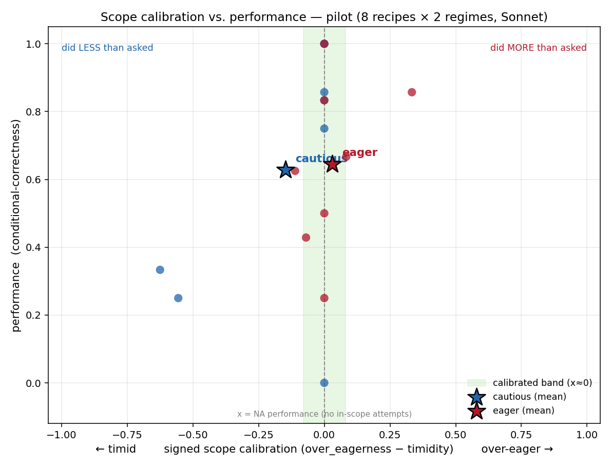

# eager-baker

A **scope-calibration benchmark**: does a recipe-executing model do *exactly* the
slice of a task it was asked to do — no less (timidity), no more (over-eagerness) —
and how does that trade off against how well it performs the assigned slice?

Built **on top of** the [MUHAI Recipe Execution Benchmark](https://ehai.ai.vub.ac.be/recipe-execution-benchmark/),
but **inverting its scoring rule**: MUHAI rewards complete, faithful execution of
a whole recipe; here the model is given only a *slice* (steps i..j) and is rewarded
for executing exactly that slice plus its necessary preconditions, then **stopping**.
Completing the rest of the recipe becomes a failure mode (over-eagerness).

## Two orthogonal axes

- **Performance (y):** conditional-correctness — of the in-scope ops the model
  *attempted*, what fraction were correct? (Competence.)
- **Scope calibration (x, signed):** `over_eagerness − timidity`. `<0` timid,
  `≈0` calibrated, `>0` over-eager. (Calibration, kept separate from competence.)

## Status

Phases 1–4 complete; pilot shows the cautious vs. eager dispositions separating on
the scope axis at equal performance. See **[STATUS.md](STATUS.md)** for the current
state and **[FINDINGS.md](FINDINGS.md)** for results + limitations.



## Documents

| file | what |
|---|---|
| [SETUP.md](SETUP.md) | environment + reproduced MUHAI example output |
| [PHASE1_ORACLE.md](PHASE1_ORACLE.md) | the hard gate: precondition vs. sequence edges are separable (PASS) |
| [SCORING.md](SCORING.md) | the frozen metric |
| [FINDINGS.md](FINDINGS.md) | pilot results, noise sources, assumptions |
| [STATUS.md](STATUS.md) | checkpoint / what's next |

## Code (`src/`)

| file | what |
|---|---|
| `mcl.py` | MUHAI Cooking Language parser + precondition/sequence graph |
| `slicer.py` | `make_task(recipe, i, j)` → slice + symbolic prefix state |
| `score.py` | the frozen metric (naming-invariant op matching) |
| `test_score.py` | scorer unit tests (run before trusting any results) |
| `model_harness.py` | model-agnostic interface + cautious/eager personas |
| `pilot_setup.py` / `pilot_run.py` / `plot.py` | run + score + plot the pilot |
| `phase1_verify.py` / `phase1_worked_example.py` / `phase2_dump.py` | gate + slicer evidence |

## Reproduce

The MUHAI benchmark itself (~213 MB) is **not** committed; re-fetch it per
[SETUP.md §1](SETUP.md), then:

```bash
cd src
python3 test_score.py    # scorer unit tests
python3 phase1_verify.py # Phase-1 gate evidence
python3 pilot_setup.py   # build tasks + prompts
# run the prompts through a model -> results/pilot/*.solution
python3 pilot_run.py     # score -> results/pilot_results.csv
python3 plot.py          # -> results/pilot_plot.png
```

Built on the MUHAI Recipe Execution Benchmark (VUB AI Lab); recipe data and the
kitchen simulator are theirs and are not redistributed here.
